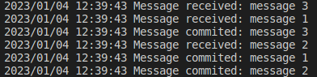

## Kafka-go example created for learning purposes.
Run with Makefile commands.  
`make run_kafka` Run kafka container  
`make run_server` Run fiber server with kafka-go writer  
`make run_listener` Run go script with kafka-go reader  
all in separate terminal windows.  
Send data to `http://localhost:8080/messages`  
Data example:  
```
{
    "messages": [
        {
            "value": "message 1"
        },
        {
            "value": "message 2"
        },
        {
            "value": "message 3"
        }
    ]
}
```  
Each individual message will be send to the broker in separate goroutine  
Next, it will be read, outputted to the terminal and committed in async manner by the listener.  
  


